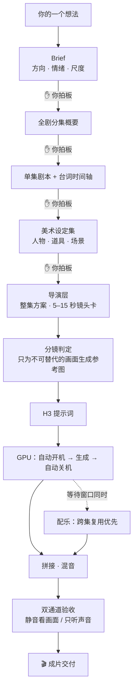

# Vibe Video：一句话，一部片

**开源 AI 视频制片技能集** · 开源模型 MiniMax H3 × AutoDL 弹性 GPU × Agent 全自动制片

[English](./README_EN.md) | 简体中文

> 你带着一个想法来——一部短剧、一支产品宣传片、一个只有十秒的视觉梗，一句话就够。
> 剩下的全部交给 AI 剧组：写方案、写剧本、做美术设定、导戏、写提示词、开服务器、生成视频、配乐、混音、验收。
> 你只在四个关卡上说「通过」或「改这里」。
>
> **10 秒 1080p 视频的生成成本约 ¥0.3**——因为跑的是 AutoDL 上的开源 MiniMax H3 模型，没有按条收费的 API 账单，而且 GPU 服务器由 Agent 自动开机、用完即关，不为等待时间付一分钱。

## 为什么是它

- **便宜到可以随便试。** 开源模型跑在自己租的 GPU 上，成本只有 GPU 租金；Agent 管理服务器的开机与关机，任务来了才点亮，全部结束立刻熄灭。10 秒 1080p 约 ¥0.3，远低于主流商业视频生成服务的定价——「先试试这个想法」不再是一个需要犹豫的决定。
- **零视频制作门槛。** 你不需要懂分镜、运镜、景别、混音。你描述画面感和氛围——「雨夜霓虹，一只机械狗叼着玫瑰穿过斑马线」——AI 把它补全成完整的导演方案、镜头卡和提示词，再把方案写成文档请你过目。人的想象力负责天马行空，Agent 负责专业细节。
- **不只短剧。** 竖屏短剧是它编排最完整的一条流水线（多集续作、状态落盘、断点恢复），但同一套技能可以直接组合出产品宣传片、软件演示、创意短片、氛围视频——几乎任何你想得到的视频作品。

## 它是怎么工作的



**人机分工就一条线：你出想象力，AI 出专业能力。** AI 从不闷头烧钱——每个阶段先把方案写成文档，列给你看，你明确说「通过」它才进入下一步；你说「改这里」它只改当前阶段。中途随时可以走，下次回来它读 `制作进度.md` 从断点继续，已通过的内容一个字不会动。

## 成本为什么这么低

1. **开源模型，无按条计费。** MiniMax H3 部署在 AutoDL 的 ComfyUI 实例上，你只付 GPU 租金，不存在「每生成一条视频付一次 API 费」。
2. **Agent 管电。** 提交任务前才 API 开机、等 ComfyUI 就绪才提交；全部任务进入终态后立即关机（含异常兜底路径）。配乐处理不需要 GPU，绝不为音乐单独开机。计费时间 ≈ 纯生成时间。
3. **校准片先行。** 先用最少片段验证导演风格和最高风险镜头，通过后才提交整批——废片和重生成被压到最低。
4. **参考图宁缺毋滥。** 只有不可替代的关键构图才生成静态参考图，其余交给模型的连续动作与运镜能力。
5. **音乐 REUSE_FIRST。** 先检索本项目已有素材，本地裁剪、循环、闪避能解决的绝不重新生成。

实际成本随 AutoDL 市价与实例规格浮动，以平台计费为准。

## 能做什么

| 你想做的 | 怎么用 | 需要的技能 |
|---|---|---|
| 竖屏短剧（多集续作） | 全流程编排，四个确认关卡 | 全部 9 个 |
| 产品 / 品牌宣传片 | 出镜头方案 → 风格帧 → 生成 → 配乐 | 导演 + 生图 + 提示词 + 生成 + 音乐 |
| 软件演示 / 功能介绍 | 画面描述 → 提示词 → 生成 | 提示词 + 生成 |
| 创意短片 / 氛围视频 / 视觉梗 | 一句话画面感 → 直接生成 | 提示词 + 生成（+ 自动开关机） |

试试这些开场白：

> 用 short-drama-production 把「深海邮递员」做成 3 集竖屏短剧，每集 3 分钟，先给我 Brief。

> 用 h3-prompt-writing 和 minimax-h3 生成一段 10 秒竖屏视频：雨夜霓虹街头，一只机械狗叼着玫瑰花穿过斑马线，缓慢跟拍，赛博朋克氛围。

> 给我的笔记 App 做一支 30 秒宣传片：先用 h3-short-drama-director 出整支片子的镜头方案和导演说明，我确认后再生成。

## 9 个技能 = 一个 AI 剧组

| 技能 | 剧组职位 | 干什么 |
|---|---|---|
| `short-drama-production` | 执行制片 | 流程状态机、确认关卡、目录规范、断点续作 |
| `short-drama-screenplay-writing` | 编剧 | 场景设计、可演剧本、人物化对白、台词时间轴 |
| `character-three-view` | 美术指导 | 人物 / 道具 / 场景设定规范与逐图验收 |
| `cursor-image-gen` | 美术执行 | 调用本地 Cursor Agent 生成与编辑图片 |
| `h3-short-drama-director` | 导演 | 整集导演方案、镜头卡、连续性台账、样片裁决 |
| `h3-prompt-writing` | 提示词师 | 把导演镜头卡翻译成 H3 原生提示词 |
| `minimax-h3` | 摄影棚 | ComfyUI 工作流发现、上传、提交、轮询、下载 |
| `autodl-app-instance` | 场务 | GPU 服务器自动开机、等就绪、用完即关 |
| `minimax-music-gen` | 配乐师 | 仅为复用覆盖不了的部分生成无主唱音乐 |

短剧全流程会把 9 个职位全部用上；做单条视频时按需点将。每个技能都可以独立调用。

## 安装

```bash
git clone https://github.com/mini-yifan/open-source-video-gen-skill.git
cd open-source-video-gen-skill

# 方式一：软链（推荐，git pull 即可更新）
for d in skills/*/; do ln -s "$(pwd)/$d" ~/.zcode/skills/"$(basename "$d")"; done

# 方式二：复制
cp -r skills/* ~/.zcode/skills/
```

## 环境要求

依赖分三级，缺哪级 AI 都会当场告诉你怎么补：

| 级别 | 依赖 | 不配会怎样 |
|---|---|---|
| 硬必需 | AutoDL 账号 + MINIMAX-H3 实例 + 开发者 Token | 无法生成视频，AI 停下并给配置指引 |
| 默认可换 | 生图（默认 Cursor Agent；可换 Codex 自带生图等） | AI 引导登录或切换替代工具 |
| 可选增强 | TokenHub 音乐 API（`TOKENHUB_API_KEY`） | 跳过独立背景音乐；H3 生成的视频自带音轨 |

另需 Agent 运行时（ZCode 或任何支持 Skills 约定的 CLI Agent）和本地工具 `ffmpeg` / `ffprobe` / `python3` / `node`。

**完整配置教程见 [SETUP.md](./SETUP.md)**（注册、申请、存储、验证、常见报错全覆盖）；一键自检：

```bash
bash scripts/doctor.sh          # 检查凭证与工具
bash scripts/doctor.sh --probe  # 额外真实探活
```

生成费用由所用第三方服务收取，与本仓库无关；发布生成内容前请确认符合平台条款与当地法规。

## 产物：AI 自己记账

每个项目的每一步都有文档落盘——方案、剧本、时间轴、美术清单、镜头卡、分镜判定、提示词、生成任务、样片裁决、音乐台账。你随时能打开看 AI 花你的钱生成了什么，也随时能从任何一个断点继续。

```text
<项目>/
├── 制作进度.md                  # 状态机：每个阶段 未开始/草稿/已通过/待更新
├── 剧名-Brief.md / 剧名-分集概要.md
├── 音乐素材复用台账.md
└── 第1集/
    ├── 剧名-第1集剧本.md         # 唯一可编辑真源
    ├── 剧名-第1集字幕台词时间轴.md
    ├── 美术设定集/
    └── 视频制作/                 # 导演方案、镜头卡、提示词、片段、音乐
```

## 工程上的讲究

- **编排与专业分离**：每类专业规则只有一份权威文件，技能间用显式契约交接，单集返修不会波及全流程。
- **真源与投影**：剧本是唯一可编辑真源，台词时间轴只是它的生产投影——改词必须先改剧本。
- **质量是硬门槛不是建议**：情绪必须有完整因果链并通过双通道验收；同一角色同画面只能出现一次，逐段抽帧检查；音乐不许盖住对白。

## 常见问题

- **只做一条 10 秒视频，也要装 9 个技能吗？** 不用。`minimax-h3` + `h3-prompt-writing` 就是最小可用组合；加上 `autodl-app-instance` 实现自动开关机；只有长片才需要编排器。
- **价格数字哪来的？** 按 AutoDL 常见实例规格实测的量级，随市价浮动；你看到账单的第一反应大概率是「就这么多？」
- **H3 提示词语法会过时吗？** 会。`h3-prompt-writing` 跟随 [MiniMax 官方仓库](https://github.com/MiniMax-AI/MiniMax-H3)，更新前先对照官方。
- **没有 Cursor / AutoDL 怎么办？** 对应阶段会明确提示缺什么并停下，不伪装、不擅自换收费服务。
- **中文文件名在 Windows 上乱码？** `git config --global core.quotepath false`。

## 协议与致谢

[MIT License](./LICENSE)。导演技能借鉴了多个开源项目，版权声明集中记录在 [NOTICE](./NOTICE)，在此一并致谢。贡献指南见 [CONTRIBUTING.md](./CONTRIBUTING.md)。
