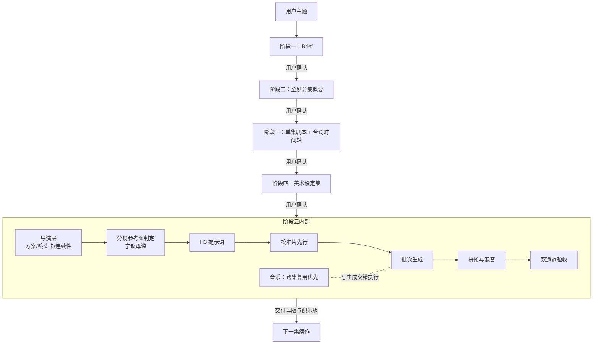

# 短剧全流程制作技能集

[English](./README_EN.md) | 简体中文

一套由 **9 个 AI Agent 技能**组成的短剧生产流水线：从一个主题想法开始，经过 Brief、全剧分集概要、单集剧本与台词时间轴、美术设定、导演分镜、MiniMax H3 视频生成、跨集复用配乐，直到交付带混音的成片。每个阶段都有用户确认关卡，全程状态落盘、可断点续作。



## 技能清单

| 技能 | 角色 | 运行阶段 | 外部依赖 |
|---|---|---|---|
| `short-drama-production` | **编排器**：流程状态机、确认关卡、目录规范、阶段交接 | 全程 | — |
| `short-drama-screenplay-writing` | 编剧：场景设计、可演剧本、人物化对白、台词时间轴投影 | 二、三 | — |
| `character-three-view` | 美术指导：三视图/道具/场景规范与逐图验收 | 四 | — |
| `cursor-image-gen` | 生图执行：调用本地 Cursor Agent 生成与编辑位图 | 四、五 | Cursor Agent |
| `h3-short-drama-director` | 导演层：整集方案、5–15 秒镜头卡、连续性台账、样片裁决 | 五 | — |
| `h3-prompt-writing` | 提示词转换：导演卡 → H3 原生提示词正文 | 五 | — |
| `minimax-h3` | 生成执行：ComfyUI 工作流发现、上传、提交、轮询、下载 | 五 | SeetaCloud / AutoDL ComfyUI |
| `autodl-app-instance` | 算力开关：API 开机、等 ready、批次结束关机 | 五 | AutoDL API Token |
| `minimax-music-gen` | 配乐补缺：仅为复用覆盖不了的 cue 生成无主唱音乐 | 五 | MiniMax 音乐 API |

所有技能也可**独立使用**：只写剧本、只生成一段 H3 视频、只做美术设定集，都可以直接触发对应技能，不必跑全流程。

## 核心设计

1. **编排与专业分离**。编排器只管"什么时候、做什么、找谁确认"，不写一句剧本、不画一张图。每个专业规则（情绪表演、分镜判定、导演卡 schema、对白方法）只有一份权威文件，其他技能引用而不复述。
2. **真源与投影**。单集剧本是唯一可编辑真源，台词时间轴只是它的生产投影——改词必须先改剧本再重建时间轴。项目状态写在 `制作进度.md`，跨会话恢复从第一个未通过的阶段继续。
3. **质量硬门槛**，不是建议：
   - 情绪必须有「触发 → 可见表演 → 策略变化 → 对手反应 → 局面后果」完整因果链，成片做静音看画面、只听声音的双通道验收；
   - 角色唯一性：同一具名角色同画面只能出现一次，提示词先正向精确计数再负向禁令，逐段抽帧验收；
   - 校准片先行：先小批量验证导演声音和最高风险片段，锁定后再提交整批；
   - 音乐 REUSE_FIRST：先检索本集和前几集已验收音频，本地裁剪/闪避能解决的绝不重新生成。

## 环境要求与成本

- **Agent 运行时**：ZCode 或任何支持 Skills 约定（`SKILL.md` frontmatter）的 CLI Agent。
- **MiniMax H3 视频生成**：SeetaCloud 或 AutoDL 上的 ComfyUI 实例（技能会自动发现当前工作流）。**GPU 实例按量计费**；一个视频批次只开机一次，结束自动关机。
- **图像生成**：本地 Cursor Agent（需要 Cursor 订阅）。
- **音乐生成**：MiniMax 音乐 API（仅在跨集复用无法覆盖时调用）。
- **本地工具**：`ffmpeg`（拼接与混音）、`ffprobe`（音频验收）、Python 3（生成脚本）。

生成费用由所用第三方服务收取，与本仓库无关；发布生成内容前请自行确认符合平台条款与当地法规。

## 安装

```bash
git clone https://github.com/mini-yifan/open-source-video-gen-skill.git
cd open-source-video-gen-skill

# 方式一：软链（推荐，git pull 即可更新）
for d in skills/*/; do ln -s "$(pwd)/$d" ~/.zcode/skills/"$(basename "$d")"; done

# 方式二：复制
cp -r skills/* ~/.zcode/skills/
```

## 快速开始

对 Agent 说：

> 用 short-drama-production 把「重生复仇打脸」做成一部 3 集竖屏短剧，单集 3 分钟，先给我 Brief。

之后按关卡推进：**Brief → 分集概要 → 第 1 集剧本+时间轴 → 美术 → 成片**。每个关卡 Agent 会停下来等你明确说"通过"才进入下一阶段；说"第 2 集继续"即按同一流程续作。中途退出没关系，下次恢复任务时它会读 `制作进度.md` 从断点继续。

## 产物目录

每个项目会生成结构固定的目录树，剧本、时间轴、美术、提示词、片段、音乐各归其位：

```text
<项目>/
├── 制作进度.md                 # 状态机：每个阶段的 未开始/草稿/已通过/待更新
├── 剧名-Brief.md
├── 剧名-分集概要.md
├── 音乐素材复用台账.md
└── 第1集/
    ├── 剧名-第1集剧本.md        # 唯一可编辑真源
    ├── 剧名-第1集字幕台词时间轴.md
    ├── 美术设定集/（人物三视图、表情参考、道具、场景）
    └── 视频制作/
        ├── 导演/（方案、镜头表、连续性台账、校准与返修记录）
        ├── 分镜参考图/ + 分镜参考图判定.md
        ├── 提示词/（NN-brief.md → NN.txt）
        ├── 片段/（NN.mp4）
        └── 音乐/（配乐设计、复用记录）
```

最终交付 `剧名-第N集.mp4`（无配乐母版）与 `剧名-第N集-配乐版.mp4`。

## 常见问题

- **H3 提示词语法会不会过时？** H3 迭代很快。`h3-prompt-writing` 的语法参考来自 [MiniMax 官方仓库](https://github.com/MiniMax-AI/MiniMax-H3)，更新本仓库前建议先对照官方最新版本。
- **没有 Cursor / AutoDL 怎么办？** 对应阶段会明确提示缺少哪种能力并停下，不会伪装已生成素材，也不会擅自切换到额外收费的服务。美术与生图依赖 Cursor Agent；视频生成依赖 SeetaCloud 或 AutoDL。
- **中文文件名在 Windows 上乱码？** 执行 `git config --global core.quotepath false` 即可正常显示。
- **为什么是 9 个技能而不是 1 个大技能？** 每个专业领域一份规则、一个权威文件，Agent 在对应阶段只装载所需指令；技能间用显式契约（模式名、SOURCE_CONFLICT、UPSTREAM_CHANGE_REQUEST）交接，单集返修不会波及全流程。

## 贡献

见 [CONTRIBUTING.md](./CONTRIBUTING.md)。模型语法类改动请附官方仓库依据；导演与编剧方法类改动请先阅读对应技能内的单一真源文件。

## 协议与致谢

[MIT License](./LICENSE)。

本仓库的导演技能借鉴了多个开源项目的思想，它们的版权声明与引用范围集中记录在 [NOTICE](./NOTICE) 与 `skills/h3-short-drama-director/references/source-notes.md`，在此一并致谢。
