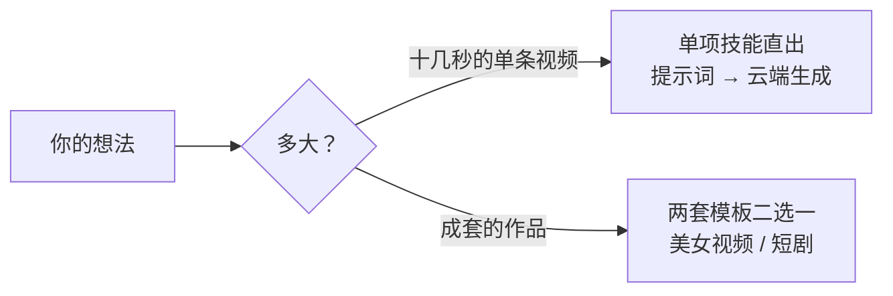

# Vibe Video：一句话，一部片

**开源 AI 视频制片技能集** · 开源模型 MiniMax H3 × AutoDL 弹性 GPU × Agent 全自动制片

[English](./README_EN.md) | 简体中文

> 你带着一个想法来——一个只有十秒的视觉梗、一支美女时尚单片、一部多集短剧，一句话就够。
> 十几秒的单条视频，点一个技能直接出片，不走流程；成套的作品，交给两套人机协作视频模板——写方案、写剧本、做美术设定、开服务器、生成视频、配乐、混音、验收，你只在关卡上说「通过」或「改这里」。
>
> **10 秒 1080p 视频的生成成本约 ¥0.3**——因为跑的是 AutoDL 上的开源 MiniMax H3 模型，没有按条收费的 API 账单，而且 GPU 服务器由 Agent 自动开机、用完即关，不为等待时间付一分钱。

## 为什么是它

- **便宜到可以随便试。** 开源模型跑在自己租的 GPU 上，成本只有 GPU 租金；Agent 管理服务器的开机与关机，任务来了才点亮，全部结束立刻熄灭。10 秒 1080p 约 ¥0.3，远低于主流商业视频生成服务的定价——「先试试这个想法」不再是一个需要犹豫的决定。
- **零视频制作门槛。** 你不需要懂分镜、运镜、景别、混音。十秒的单条视频，你给画面感，AI 补全成专业提示词；成套的作品，AI 把它补全成完整的剧本、美术参考和生成提示词，并把方案写成文档请你过目。人的想象力负责天马行空，Agent 负责专业细节。
- **多大点多大。** 单项技能随点随用——生成三视图、生成图片、生成视频、生成音乐、生成 TTS 语音，都不必启动任何流程；需要成套作品时，两套模板负责把活从头带到尾。

## 先看你的活有多大



**十秒级的单条视频，不需要任何流程。** `minimax-h3` + `h3-prompt-writing` 就是最小可用组合，加上 `autodl-app-instance` 即可自动开关机；真人时尚单片直接点 `beauty-video-gen`，一条技能内完成提示词、生成、验收、滤镜。

**成套的作品，交给两套现成模板。** 模板内的 AI 从不闷头烧钱——每个阶段先把方案写成文档请你过目，你说「通过」才进入下一步；中途随时可以走，下次回来从断点继续，已通过的内容一个字不会动。

| 模板 | 适合 | 怎么协作 | 详细指南 |
|---|---|---|---|
| `beauty-video-gen` 美女视频模板 | 超写实真人美女时尚竖屏单片（10 秒级） | 给需求 → 确认参考图（可选）→ 云端出片 → 确认滤镜效果 | [美女视频生成指南](./docs/美女视频生成指南.md) |
| `short-drama-production` 短剧模板 | 竖屏短剧（多集续作）；宣传片、软件演示、创意短片同用此流程 | 确认关卡：Brief →（多集时的）分集概要 → 剧本+台词 → 美术，成片后再定修改方向；单部小短片跳过分集概要 | [短剧创作指南](./docs/短剧创作指南.md) |

试试这些开场白：

> 用 beauty-video-gen 生成一条 10 秒竖屏美女时尚视频，可爱亲切风格，先出一张面部参考图定脸。

> 用 h3-prompt-writing 和 minimax-h3 生成一段 10 秒竖屏视频：雨夜霓虹街头，一只机械狗叼着玫瑰花穿过斑马线，缓慢跟拍，赛博朋克氛围。

> 用 short-drama-production 把「深海邮递员」做成 3 集竖屏短剧，每集 3 分钟，先给我 Brief。

## 九个技能，按需点将

模板是组合拳，但每个单项技能都能脱离模板独立使用。

**两套成片模板：**

| 技能 | 干什么 |
|---|---|
| `beauty-video-gen` | 美女时尚单片模板：提示词框架、可选定脸、云端出片、提亮滤镜、抽帧验收一条龙 |
| `short-drama-production` | 短剧/成片模板：流程状态机、确认关卡、目录规范、断点续作，调度其余技能 |

**可以单独使用的生成技能：**

| 技能 | 单独点名能干什么 |
|---|---|
| `h3-prompt-writing` | 把画面感写成 H3 原生提示词（文生视频 / 图生视频 / 参考生视频都覆盖） |
| `minimax-h3` | 云端生成视频：工作流发现、素材上传、提交、轮询、下载 |
| `autodl-app-instance` | GPU 服务器自动开机、等就绪、用完即关 |
| `character-three-view` | 人物 / 道具三视图、场景概念图，逐图验收 |
| `cursor-image-gen` | 用本地 Cursor Agent 生成与编辑图片（生图备选执行器，点名即用） |
| `minimax-music-gen` | 生成人声演唱的完整歌曲（自定义歌词）或纯音乐 BGM |
| `qwen3-tts` | 配音：文字描述声线 / 内置音色 / 声音克隆 |

## 成本为什么这么低

1. **开源模型，无按条计费。** MiniMax H3 部署在 AutoDL 的 ComfyUI 实例上，你只付 GPU 租金，不存在「每生成一条视频付一次 API 费」。
2. **Agent 管电。** 提交任务前才 API 开机、等 ComfyUI 就绪才提交；全部任务进入终态后立即关机（含异常兜底路径）。配乐处理不需要 GPU，绝不为音乐单独开机。计费时间 ≈ 纯生成时间。
3. **校准片先行。** 先用最少片段验证风格和最高风险镜头，通过后才提交整批——废片和重生成被压到最低。
4. **参考图宁缺毋滥。** 只有不可替代的关键构图才生成静态参考图，其余交给模型的连续动作与运镜能力。
5. **音乐 REUSE_FIRST。** 先检索本项目已有素材，本地裁剪、循环、闪避能解决的绝不重新生成。

实际成本随 AutoDL 市价与实例规格浮动，以平台计费为准。

## 安装

```bash
git clone https://github.com/mini-yifan/open-source-video-gen-skill.git
cd open-source-video-gen-skill

# 方式一：软链（推荐，git pull 即可更新）
for d in skills/*/; do ln -s "$(pwd)/$d" ~/.zcode/skills/"$(basename "$d")"; done

# 方式二：复制
cp -r skills/* ~/.zcode/skills/
```

## 环境要求

依赖分三级，缺哪级 AI 都会当场告诉你怎么补：

| 级别 | 依赖 | 不配会怎样 |
|---|---|---|
| 硬必需 | AutoDL 账号 + MINIMAX-H3 实例 + 开发者 Token | 无法生成视频，AI 停下并给配置指引 |
| 默认可换 | 生图（优先 Agent 自带生图能力；备选 Cursor Agent，可按点名换其它） | AI 引导登录或切换替代工具 |
| 可选增强 | 音乐生成与 Qwen3-TTS 配音（同一台 AutoDL 实例、同一个 Token，无需新凭证；TTS 需实例预装节点） | 各自跳过；H3 生成的视频自带音轨与对白 |

另需 Agent 运行时（ZCode 或任何支持 Skills 约定的 CLI Agent）和本地工具 `ffmpeg` / `ffprobe` / `python3` / `node`。

**完整配置教程见 [SETUP.md](./SETUP.md)**（注册、申请、存储、验证、常见报错全覆盖）；一键自检：

```bash
bash scripts/doctor.sh          # 检查凭证与工具
bash scripts/doctor.sh --probe  # 额外真实探活
```

生成费用由所用第三方服务收取，与本仓库无关；发布生成内容前请确认符合平台条款与当地法规。

## 常见问题

- **只做一条 10 秒视频，也要装全部 9 个技能吗？** 不用。`minimax-h3` + `h3-prompt-writing` 就是最小可用组合；美女时尚单片直接 `beauty-video-gen`。全套装上也无妨——技能按需点将，用不到的不会被唤醒。
- **价格数字哪来的？** 按 AutoDL 常见实例规格实测的量级，随市价浮动；你看到账单的第一反应大概率是「就这么多？」
- **H3 提示词语法会过时吗？** 会。`h3-prompt-writing` 跟随 [MiniMax 官方仓库](https://github.com/MiniMax-AI/MiniMax-H3)，更新前先对照官方。
- **没有 Cursor / AutoDL 怎么办？** 对应阶段会明确提示缺什么并停下，不伪装、不擅自换收费服务。
- **中文文件名在 Windows 上乱码？** `git config --global core.quotepath false`。

## 协议与致谢

[MIT License](./LICENSE)。本仓库部分内容曾借鉴多个开源项目，版权声明集中记录在 [NOTICE](./NOTICE)，在此一并致谢。贡献指南见 [CONTRIBUTING.md](./CONTRIBUTING.md)。
