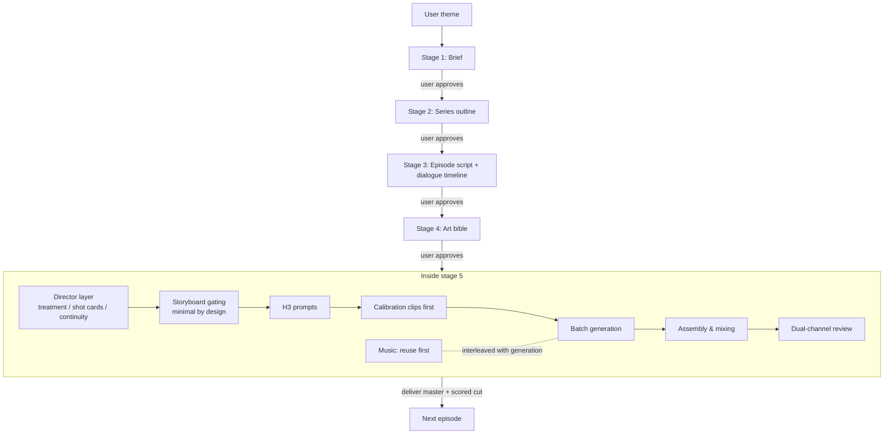

# Short-Drama Production Skill Suite

English | [简体中文](./README.md)

A short-drama production pipeline built from **9 AI agent skills**: starting from a theme idea, it proceeds through a brief, full-series episode outlines, per-episode screenplays with calibrated dialogue timelines, an art bible, an independent directing pass, MiniMax H3 video generation, cross-episode music reuse, and finally a mixed, finished episode. Every stage has a user approval gate; all state is written to disk so any session can resume from the breakpoint.



## Skills

| Skill | Role | Stage | External dependency |
|---|---|---|---|
| `short-drama-production` | **Orchestrator**: flow state machine, approval gates, directory canon, stage handoff | all | — |
| `short-drama-screenplay-writing` | Screenwriter: scene design, playable script, character-specific dialogue, timeline projection | 2, 3 | — |
| `character-three-view` | Art direction: turnarounds / props / environments with per-image review | 4 | — |
| `cursor-image-gen` | Image execution: local Cursor Agent bitmap generation and editing | 4, 5 | Cursor Agent |
| `h3-short-drama-director` | Director layer: episode treatment, 5–15 s shot cards, continuity ledger, take review | 5 | — |
| `h3-prompt-writing` | Prompt conversion: director cards → native H3 prompt bodies | 5 | — |
| `minimax-h3` | Generation execution: ComfyUI workflow discovery, upload, submit, poll, download | 5 | SeetaCloud / AutoDL ComfyUI |
| `autodl-app-instance` | Compute switch: API power-on, wait-ready, power-off after the batch | 5 | AutoDL API token |
| `minimax-music-gen` | Music gap-filler: instrumental cues only where reuse cannot cover | 5 | MiniMax music API |

Every skill is also **usable standalone** — writing a script, generating one H3 clip, or producing an art bible can each be triggered directly without the full pipeline.

## Core design

1. **Orchestration is separate from craft.** The orchestrator only decides what happens when and who approves it. Every professional rule (emotion and performance, storyboard gating, shot-card schema, dialogue method) has exactly one authoritative file; other skills link to it instead of restating it.
2. **Single source of truth, projections downstream.** The episode script is the only editable source; the dialogue timeline is a production projection of it — wording changes go back to the script first. Project state lives in `制作进度.md` (progress.md); resuming always continues from the first unapproved stage.
3. **Quality is enforced by hard gates**, not suggestions:
   - every emotion needs a full causal chain — trigger → visible performance → tactic change → opponent reaction → changed situation — and finished cuts are reviewed with the sound off, then audio-only;
   - character uniqueness: a named character appears exactly once per frame; prompts state exact positive counts before negative bans, and frames are spot-checked per segment;
   - calibration clips come first: validate the directorial voice and highest-risk segments on a small batch before committing;
   - music is REUSE_FIRST: search this and previous episodes' accepted audio before ever calling a generation API.

## Requirements and cost

- **Agent runtime**: ZCode or any CLI agent that supports the Skills convention (`SKILL.md` frontmatter).
- **MiniMax H3 video generation**: a ComfyUI instance on SeetaCloud or AutoDL (the skill discovers current workflows automatically). **GPU instances bill by usage**; each video batch powers on once and powers off when finished.
- **Image generation**: a local Cursor Agent (requires a Cursor subscription).
- **Music generation**: the MiniMax music API (only for cues reuse cannot cover).
- **Local tools**: `ffmpeg` (assembly and mixing), `ffprobe` (audio QC), Python 3 (generation scripts).

Generation costs are charged by the third-party services, not by this repository; make sure published content complies with the platform terms and your local regulations.

## Installation

```bash
git clone https://github.com/mini-yifan/open-source-video-gen-skill.git
cd open-source-video-gen-skill

# Option A: symlink (recommended; update with git pull)
for d in skills/*/; do ln -s "$(pwd)/$d" ~/.zcode/skills/"$(basename "$d")"; done

# Option B: copy
cp -r skills/* ~/.zcode/skills/
```

## Quick start

Tell your agent:

> Use short-drama-production to turn "reincarnation revenge" into a 3-episode vertical short drama, 3 minutes per episode; start with the brief.

From there the gates advance: **brief → series outline → episode 1 script + timeline → art → finished episode**. At each gate the agent stops and waits for an explicit "approved" before moving on; saying "continue with episode 2" runs the same loop. Interrupting is safe — the next session reads `制作进度.md` and resumes from the breakpoint.

## Output layout

Every project produces a fixed directory tree that keeps scripts, timelines, art, prompts, clips, and music in their own places:

```text
<project>/
├── 制作进度.md                 # state machine: not started / draft / approved / stale
├── <title>-Brief.md
├── <title>-episode-outlines.md
├── music-reuse-ledger.md
└── episode-01/
    ├── <title>-ep01-script.md   # the only editable source
    ├── <title>-ep01-timeline.md
    ├── art/ (turnarounds, expressions, props, environments)
    └── production/
        ├── directing/ (treatment, shot list, continuity ledger, calibration & retake log)
        ├── storyboards/ + storyboard-decisions.md
        ├── prompts/ (NN-brief.md → NN.txt)
        ├── clips/ (NN.mp4)
        └── music/ (score design, reuse log)
```

Final deliveries are `<title>-epNN.mp4` (unscored master) and `<title>-epNN-scored.mp4`.

## FAQ

- **Will the H3 prompt syntax drift out of date?** H3 iterates quickly. `h3-prompt-writing` follows the [official MiniMax repository](https://github.com/MiniMax-AI/MiniMax-H3); check there for the latest before updating this repo.
- **No Cursor / AutoDL access?** The affected stage reports the missing capability and stops. Nothing is faked and no paid service is silently substituted.
- **Chinese filenames garbled on Windows?** Run `git config --global core.quotepath false`.
- **Why 9 skills instead of one big one?** Each craft has one rule file and one owner; the agent loads only what a stage needs, and skills hand off through explicit contracts (mode names, `SOURCE_CONFLICT`, `UPSTREAM_CHANGE_REQUEST`), so a retake on one episode never ripples through the whole pipeline.

## Contributing

See [CONTRIBUTING.md](./CONTRIBUTING.md). Model-syntax changes should cite the official repository; directing and screenwriting changes should start from the single authoritative file inside the corresponding skill.

## License and acknowledgments

[MIT License](./LICENSE).

The directing skill adapts ideas from several open-source projects; their copyright notices and the scope of reuse are recorded in [NOTICE](./NOTICE) and `skills/h3-short-drama-director/references/source-notes.md`. Our thanks to all of them.
