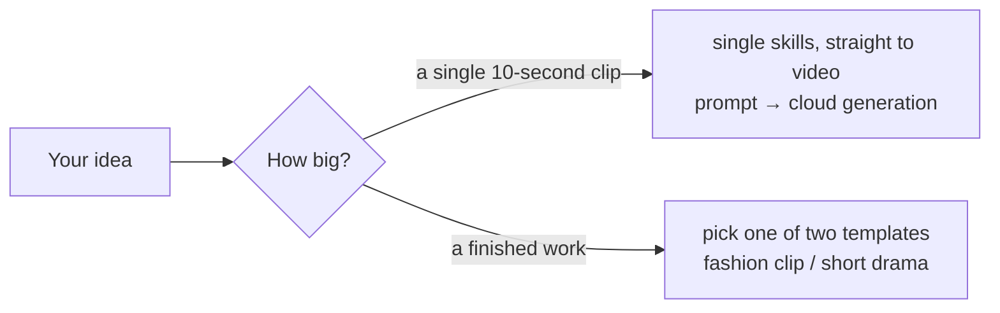

# Vibe Video: One Sentence In, a Finished Film Out

**Open-source AI video production skill suite** · Open MiniMax H3 × elastic AutoDL GPUs × fully agent-managed production

English | [简体中文](./README.md)

> Bring an idea — a ten-second visual gag, a fashion clip, or a multi-episode short drama. One sentence is enough.
> A clip that's a dozen seconds long takes a single skill and zero pipeline; finished, multi-part works get one of two human-AI video templates — treatment, script, art references, server power-up, generation, scoring, mixing, and review. You only say "approved" or "change this" at the gates.
>
> **Generating 10 seconds of 1080p video costs about ¥0.3 (~$0.04)** — because the open-source MiniMax H3 model runs on your own AutoDL instance (no per-video API bill), and the agent powers the GPU on only when there is work, off the moment it's done. You never pay for waiting.

## Why this exists

- **Cheap enough to experiment freely.** An open model on a rented GPU means your cost is compute time, nothing else. The agent manages server power: boot when jobs are ready, shut down when they finish. At roughly ¥0.3 per 10 s of 1080p — far below commercial video-generation pricing — "let me just try this idea" stops being a decision.
- **Zero video-production background required.** You describe the vibe and the image. For a single clip, the AI expands it into a professional prompt; for a finished work, it expands it into a full script, art references, and model prompts, then writes it all down and asks for your sign-off. Humans supply imagination; the agent supplies the craft.
- **Hire exactly as much as you need.** Every single skill works à la carte — three-view character sheets, image generation, video generation, music, TTS voiceover — no orchestration required. For full works, the two templates carry the job end to end.

## First, how big is the job?



**A ten-second clip needs no pipeline.** `minimax-h3` + `h3-prompt-writing` is the minimal viable set; add `autodl-app-instance` for automatic power management. For live-model fashion clips, call `beauty-video-gen` directly — prompts, generation, review, and the glow filter all happen inside one skill.

**Finished works go through one of two ready-made templates.** The AI never burns money silently inside a template — every stage is written into a document and shown to you first; it proceeds only after your explicit "approved." Walk away any time; the next session resumes from the breakpoint with approved content untouched.

| Template | Best for | How it collaborates | Guide (Chinese) |
|---|---|---|---|
| `beauty-video-gen` — fashion clip | hyper-real live-model fashion verticals (10 s class) | give the brief → approve face reference (optional) → cloud generation → approve the filter | [美女视频生成指南](./docs/美女视频生成指南.md) |
| `short-drama-production` — short drama | vertical short drama (multi-episode); the same pipeline also runs product promos, software demos, and creative shorts | approval gates: brief → series outline (multi-episode only) → script + dialogue → art; you set the revision direction after delivery. Single one-minute shorts skip the outline | [短剧创作指南](./docs/短剧创作指南.md) |

Try these openers:

> Use beauty-video-gen to make a 10-second vertical fashion clip, cute and warm vibe; show me a face reference first.

> Use h3-prompt-writing and minimax-h3 to generate a 10-second vertical clip: a robotic dog carrying a rose crosses a zebra crossing on a rainy neon street, slow tracking shot, cyberpunk mood.

> Use short-drama-production to turn "the deep-sea mail carrier" into a 3-episode vertical short drama, 3 minutes each; start with the brief.

## Nine skills, hired à la carte

Templates are combinations, but every single skill works standalone.

**The two templates:**

| Skill | What it does |
|---|---|
| `beauty-video-gen` | fashion-clip template: prompt framework, optional face reference, cloud generation, glow filter, frame review in one skill |
| `short-drama-production` | drama/finished-work template: flow state machine, approval gates, directory canon, resumable state; orchestrates the rest |

**Skills you can call on their own:**

| Skill | What it does standalone |
|---|---|
| `h3-prompt-writing` | turns your visual idea into native H3 prompts (t2v / i2v / reference-to-video) |
| `minimax-h3` | cloud video generation: workflow discovery, upload, submit, poll, download |
| `autodl-app-instance` | auto power-on, wait-ready, power-off for the GPU server |
| `character-three-view` | character / prop turnarounds, scene concepts, per-image review |
| `cursor-image-gen` | bitmap generation and editing via the local Cursor Agent (fallback image executor, on request) |
| `minimax-music-gen` | full songs with vocals (custom lyrics) or instrumental BGM |
| `qwen3-tts` | voiceover: described voices / built-in speakers / voice clone |

## Why it's this cheap

1. **Open model, no per-video billing.** MiniMax H3 runs on a ComfyUI instance on AutoDL. You pay GPU rent — there is no API fee per generated clip.
2. **The agent manages power.** It boots the instance via API only when jobs are ready, submits only after ComfyUI is up, and powers off the moment every task reaches a terminal state (with a failure-path fallback). Music needs no GPU, so it never boots one for audio. Billed time ≈ pure generation time.
3. **Calibration clips first.** The smallest set of clips validates the style and the highest-risk shots before the full batch — waste and regeneration are minimized.
4. **Storyboards only where irreplaceable.** Static reference images are generated only for compositions the text and art bible cannot pin down; everything else is left to the model's continuous motion and camera ability.
5. **Music is reuse-first.** Existing project audio is searched first; anything local trimming, looping, or ducking can adapt is never regenerated.

Actual costs float with AutoDL market prices and instance type; the platform's billing is the source of truth.

## Installation

```bash
git clone https://github.com/mini-yifan/open-source-video-gen-skill.git
cd open-source-video-gen-skill

# Option A: symlink (recommended; update with git pull)
for d in skills/*/; do ln -s "$(pwd)/$d" ~/.zcode/skills/"$(basename "$d")"; done

# Option B: copy
cp -r skills/* ~/.zcode/skills/
```

## Requirements

Dependencies come in three tiers — whatever is missing, the AI tells you on the spot how to fix it (the detailed setup guide is in Chinese, since the services involved are China-based):

| Tier | Dependency | If missing |
|---|---|---|
| Hard-required | AutoDL account + MINIMAX-H3 instance + developer token | video generation blocks with setup guidance |
| Replaceable default | image generation (prefers the running agent's built-in image tool; Cursor Agent as fallback or on explicit request) | the AI guides login or switches to your alternative tool |
| Optional enhancement | music generation & Qwen3-TTS dubbing (same AutoDL instance, same token, no new credentials; TTS needs the preinstalled node) | each is skipped independently; H3 videos carry their own audio and dialogue |

You also need an agent runtime (ZCode or any CLI agent supporting the Skills convention) and local tools: `ffmpeg` / `ffprobe` / `python3` / `node`.

Full setup tutorial: [SETUP.md](./SETUP.md) (Chinese). One-shot self-check:

```bash
bash scripts/doctor.sh          # check credentials and tools
bash scripts/doctor.sh --probe  # additionally probe live endpoints
```

Generation costs are charged by the third-party services, not this repository; make sure published content complies with platform terms and your local regulations.

## FAQ

- **Do I need all nine skills for one 10-second clip?** No. `minimax-h3` + `h3-prompt-writing` is the minimal viable set; for a fashion clip call `beauty-video-gen` directly. Installing everything is fine too — skills are hired on demand, and the ones you don't need never wake up.
- **Where does the price figure come from?** Measured on typical AutoDL instance specs; it floats with market pricing. Your first bill will likely make you check it twice.
- **Will the H3 prompt syntax drift?** It can. `h3-prompt-writing` follows the [official MiniMax repository](https://github.com/MiniMax-AI/MiniMax-H3); check there before updating.
- **No Cursor / AutoDL access?** The affected stage reports the missing capability and stops — nothing is faked, no paid service is silently substituted.
- **Chinese filenames garbled on Windows?** Run `git config --global core.quotepath false`.

## License and acknowledgments

[MIT License](./LICENSE). Portions of this repository have adapted ideas from open-source projects; copyright notices are collected in [NOTICE](./NOTICE). See [CONTRIBUTING.md](./CONTRIBUTING.md) for how to contribute.
