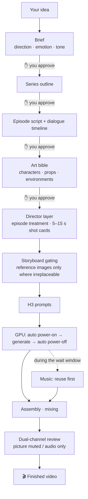

# Vibe Video: One Sentence In, a Finished Film Out

**Open-source AI video production skill suite** · Open MiniMax H3 × elastic AutoDL GPUs × fully agent-managed production

English | [简体中文](./README.md)

> Bring an idea — a short drama, a product promo, or a ten-second visual gag. One sentence is enough.
> The AI crew handles everything else: the treatment, the script, the art bible, the directing, the prompts, powering up the server, generating the footage, scoring, mixing, and final review.
> You only say "approved" or "change this" at four gates.
>
> **Generating 10 seconds of 1080p video costs about ¥0.3 (~$0.04)** — because the open-source MiniMax H3 model runs on your own AutoDL instance (no per-video API bill), and the agent powers the GPU on only when there is work, off the moment it's done. You never pay for waiting.

## Why this exists

- **Cheap enough to experiment freely.** An open model on a rented GPU means your cost is compute time, nothing else. The agent manages server power: boot when jobs are ready, shut down when they finish. At roughly ¥0.3 per 10 s of 1080p — far below commercial video-generation pricing — "let me just try this idea" stops being a decision.
- **Zero video-production background required.** You describe the vibe and the image — "a robotic dog carrying a rose across a neon crosswalk in the rain" — and the AI expands it into a full directing treatment, shot cards, and model prompts, then writes it all down and asks for your sign-off. Humans supply imagination; the agent supplies the craft.
- **Not just short drama.** Vertical short drama is the most complete pipeline (multi-episode continuation, on-disk state, resumable breakpoints), but the same skills compose into product promos, software demos, creative shorts, and ambient videos — almost any video you can imagine.

## How it works



**The division of labor is one line: you bring imagination, the AI brings craft.** It never burns money silently — every stage is written into a document and shown to you first; it proceeds only after your explicit "approved," and a "change this" only touches the current stage. Walk away any time; the next session reads the progress file and resumes from the breakpoint with approved content untouched.

## Why it's this cheap

1. **Open model, no per-video billing.** MiniMax H3 runs on a ComfyUI instance on AutoDL. You pay GPU rent — there is no API fee per generated clip.
2. **The agent manages power.** It boots the instance via API only when jobs are ready, submits only after ComfyUI is up, and powers off the moment every task reaches a terminal state (with a failure-path fallback). Music needs no GPU, so it never boots one for audio. Billed time ≈ pure generation time.
3. **Calibration clips first.** The smallest set of clips validates the directorial voice and highest-risk shots before the full batch — waste and regeneration are minimized.
4. **Storyboards only where irreplaceable.** Static reference images are generated only for compositions the text and art bible cannot pin down; everything else is left to the model's continuous motion and camera ability.
5. **Music is reuse-first.** Existing project audio is searched first; anything local trimming, looping, or ducking can adapt is never regenerated.

Actual costs float with AutoDL market prices and instance type; the platform's billing is the source of truth.

## What you can make

| Goal | How | Skills needed |
|---|---|---|
| Vertical short drama (multi-episode) | Full orchestration with four approval gates | all ten drama seats |
| Product / brand promo | shot plan → style frames → generate → score | director + image + prompts + generation + music |
| Software demo | visual description → prompts → generate | prompts + generation |
| Creative short / ambient video / visual gag | one-sentence vibe → generate | prompts + generation (+ auto power management) |
| Hyper-real fashion vertical clip (live model) | face reference (optional) → prompts → cloud generation → glow filter | `beauty-video-gen` (+ auto power management) |

Try these openers:

> Use short-drama-production to turn "the deep-sea mail carrier" into a 3-episode vertical short drama, 3 minutes each; start with the brief.

> Use h3-prompt-writing and minimax-h3 to generate a 10-second vertical clip: a robotic dog carrying a rose crosses a zebra crossing on a rainy neon street, slow tracking shot, cyberpunk mood.

> Make a 30-second promo for my note-taking app: have h3-short-drama-director produce the shot plan and director's notes first; generate after I approve.

> Use beauty-video-gen to make a 10-second vertical fashion clip, cute and warm vibe; show me a face reference first.

## Eleven skills = one AI crew

| Skill | Crew seat | What it does |
|---|---|---|
| `short-drama-production` | Line producer | flow state machine, approval gates, directory canon, resumable state |
| `short-drama-screenplay-writing` | Screenwriter | scene design, playable scripts, character-specific dialogue, timelines |
| `character-three-view` | Art director | character / prop / environment specs with per-image review |
| `cursor-image-gen` | Art execution (fallback) | bitmap generation and editing via the local Cursor Agent, when no built-in image gen exists or Cursor is explicitly requested |
| `h3-short-drama-director` | Director | episode treatment, shot cards, continuity ledger, take review |
| `h3-prompt-writing` | Prompt writer | translates director cards into native H3 prompts |
| `minimax-h3` | Soundstage | ComfyUI workflow discovery, upload, submit, poll, download |
| `autodl-app-instance` | Stagehand | auto power-on, wait-ready, power-off for the GPU server |
| `minimax-music-gen` | Composer | instrumental cues only where reuse cannot cover |
| `qwen3-tts` | Voice actor | Qwen3-TTS dubbing: described voices / built-in speakers / voice clone |
| `beauty-video-gen` | Fashion clip contractor (off-crew) | hyper-real live-model fashion verticals: prompt framework, optional face reference, cloud generation, glow filter, frame review |

The drama pipeline hires all ten drama seats; `beauty-video-gen` is a standalone fashion-clip skill outside the crew. A single clip hires only what it needs. Every skill works standalone.

## Installation

```bash
git clone https://github.com/mini-yifan/open-source-video-gen-skill.git
cd open-source-video-gen-skill

# Option A: symlink (recommended; update with git pull)
for d in skills/*/; do ln -s "$(pwd)/$d" ~/.zcode/skills/"$(basename "$d")"; done

# Option B: copy
cp -r skills/* ~/.zcode/skills/
```

## Requirements

Dependencies come in three tiers — whatever is missing, the AI tells you on the spot how to fix it (the detailed setup guide is in Chinese, since the services involved are China-based):

| Tier | Dependency | If missing |
|---|---|---|
| Hard-required | AutoDL account + MINIMAX-H3 instance + developer token | video generation blocks with setup guidance |
| Replaceable default | image generation (prefers the running agent's built-in image tool; Cursor Agent as fallback or on explicit request) | the AI guides login or switches to your alternative tool |
| Optional enhancement | TokenHub music API (`TOKENHUB_API_KEY`), Qwen3-TTS dubbing (same token; the instance must have the TTS node) | each is skipped independently; H3 videos carry their own audio and dialogue |

You also need an agent runtime (ZCode or any CLI agent supporting the Skills convention) and local tools: `ffmpeg` / `ffprobe` / `python3` / `node`.

Full setup tutorial: [SETUP.md](./SETUP.md) (Chinese). One-shot self-check:

```bash
bash scripts/doctor.sh          # check credentials and tools
bash scripts/doctor.sh --probe  # additionally probe live endpoints
```

Generation costs are charged by the third-party services, not this repository; make sure published content complies with platform terms and your local regulations.

## Output: the AI keeps its own books

Every step of every project lands as a document — treatments, scripts, timelines, art lists, shot cards, storyboard decisions, prompts, generation jobs, take verdicts, music ledgers. You can always see exactly what the AI spent your money on, and resume from any breakpoint.

```text
<project>/
├── progress.md                   # state machine per stage: draft / approved / stale
├── <title>-Brief.md / <title>-outlines.md
├── music-reuse-ledger.md
└── episode-01/
    ├── <title>-ep01-script.md    # the only editable source
    ├── <title>-ep01-timeline.md
    ├── art/
    └── production/               # directing, prompts, clips, music
```

## Engineering notes

- **Orchestration is separate from craft**: each rule domain has exactly one authoritative file; skills hand off through explicit contracts, so one episode's retake never ripples through the pipeline.
- **Single source of truth, projections downstream**: the script is the only editable source; the dialogue timeline is a projection of it.
- **Quality is enforced by hard gates, not suggestions**: full emotion causal chains with dual-channel review; exactly one instance of each named character per frame, spot-checked; music never drowns dialogue.

## FAQ

- **Do I need all 11 skills for one 10-second clip?** No. `minimax-h3` + `h3-prompt-writing` is the minimal viable set; add `autodl-app-instance` for automatic power management. The orchestrator is for long-form work.
- **Where does the price figure come from?** Measured on typical AutoDL instance specs; it floats with market pricing. Your first bill will likely make you check it twice.
- **Will the H3 prompt syntax drift?** It can. `h3-prompt-writing` follows the [official MiniMax repository](https://github.com/MiniMax-AI/MiniMax-H3); check there before updating.
- **No Cursor / AutoDL access?** The affected stage reports the missing capability and stops — nothing is faked, no paid service is silently substituted.
- **Chinese filenames garbled on Windows?** Run `git config --global core.quotepath false`.

## License and acknowledgments

[MIT License](./LICENSE). The directing skill adapts ideas from several open-source projects; copyright notices are collected in [NOTICE](./NOTICE). See [CONTRIBUTING.md](./CONTRIBUTING.md) for how to contribute.
