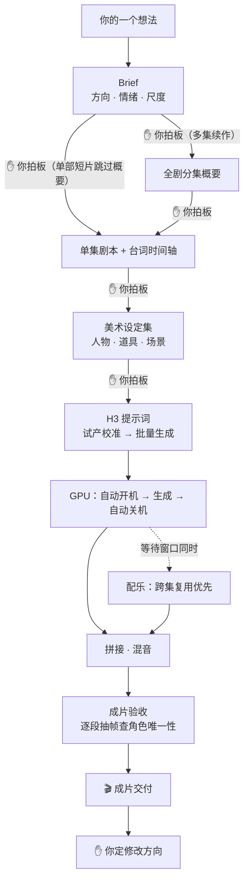

# 短剧创作指南

`short-drama-production` 是本仓库里编排最完整的一套**人机协作视频制作模板**。名字叫「短剧」，但它提供的是一条从想法到成片的完整制片流程——竖屏短剧是它编排最完整的形态，同一套流程同样能做**产品宣传片、软件演示、创意短片**。

## 什么时候用它，什么时候不用

| 你想做的 | 用法 |
|---|---|
| 竖屏短剧（多集续作） | 全流程，逐阶段确认关卡，状态落盘、断点恢复 |
| 产品 / 品牌宣传片 | 走同一套流程，「第 1 集」就是整支片；单集结构天然适合 30–60 秒的成片 |
| 软件演示 / 功能介绍 | 走同一套流程，美术阶段只出关键场景与道具 |
| 创意短片 / 氛围视频 | 走同一套流程；明确说「全自动执行」即可合并确认关卡 |

反过来说：**只是十几秒的单条视频，不需要这套流程。** 单项技能直接点用更快，见 [README](../README.md)；真人时尚单片用 `beauty-video-gen`，见 [美女视频生成指南](./美女视频生成指南.md)。

## 用前准备

| 需要 | 说明 |
|---|---|
| AutoDL 实例 + 开发者 Token | 视频生成硬必需，见 [SETUP.md](../SETUP.md) 第 1 节 |
| 生图能力 | 美术设定集用；优先 Agent 自带生图，备选 Cursor（SETUP.md 第 2 节） |
| 可选增强 | 音乐生成（MiniMax Music 3，独立配乐）、Qwen3-TTS 配音节点（旁白/声线替换）——同一实例同一 Token，无需新凭证；不配也能出片，H3 视频自带音轨与对白 |

一键自检：`bash scripts/doctor.sh`。

## 怎么开始

一句话开场：

> 用 short-drama-production 把「深海邮递员」做成 3 集竖屏短剧，每集 3 分钟，先给我 Brief。

AI 的第一个动作是给你一份 **Brief 文档**（方向、情绪、尺度），而不是直接开始生成。集数、时长、平台、受众、禁区，你提了它就照办，没提的留 `[待定]` 不会拿默认值敷衍。

## 人机分工：逐阶段确认关卡

AI 从不闷头烧钱——每个阶段先把方案写成文档列给你看，你明确说「通过」才进入下一步；你说「改这里」，它只改当前阶段。中途随时可以走，下次回来它读 `制作进度.md` 从断点继续，已通过的内容一个字不会动。



| 阶段 | 产物 | 配套技能 |
|---|---|---|
| 一、Brief | `剧名-Brief.md` | — |
| 二、全剧分集概要（仅多集） | `剧名-分集概要.md` | — |
| 三、单集剧本 + 台词时间轴 | `剧名-第N集剧本.md`（唯一真源）+ 时间轴投影 | — |
| 四、美术设定 | 人物/道具参考图、场景概念图 | `character-three-view`（生图执行器：Agent 自带生图优先，点名 Cursor 时用 `cursor-image-gen`） |
| 五、视频与配乐 | 片段提示词 → 云端生成 → 校准片 → 拼接混音 → 成片 | `h3-prompt-writing`、`minimax-h3`、`autodl-app-instance`、`minimax-music-gen`、`qwen3-tts`（可选） |

## 产物：AI 自己记账

每个项目的每一步都有文档落盘——方案、剧本、时间轴、美术参考、提示词、生成任务、音乐台账。你随时能打开看 AI 花你的钱生成了什么，也随时能从任何一个断点继续。

```text
<项目>/
├── 制作进度.md                  # 状态机：每个阶段 未开始/草稿/已通过/待更新
├── 剧名-Brief.md / 剧名-分集概要.md
├── 音乐素材复用台账.md
└── 第1集/
    ├── 剧名-第1集剧本.md         # 唯一可编辑真源
    ├── 剧名-第1集字幕台词时间轴.md
    ├── 美术设定集/
    └── 视频制作/                 # 提示词、片段、配音、音乐
```

修改只动当前阶段：你在一处提出修改，受影响的下游阶段会被标回「待更新」重新走，不沿用旧内容。

## 质量是硬门槛，不是建议

- **角色唯一性**：同一具名角色在同一画面只能出现一次，逐段抽帧检查，出现分身/重影直接判废重生成。
- **不做表情参考图**：形象外观由美术参考图锁定，表情与表演变化由提示词驱动；表情图会引发人物重影。
- **参考图宁缺毋滥**：默认不生成分镜参考图，动作、表演、运镜由提示词决定；只有你明确要求时才按指定范围制作。
- **校准片先行**：先用最少片段验证风格和最高风险镜头，通过后才提交整批。
- **音乐 REUSE_FIRST**：先检索本项目已有素材，本地裁剪循环能解决的绝不重新生成；音乐不许盖住对白。

## 常见问题

- **只想做一部一分钟左右的小短片？** 也走这套流程，但会跳过分集概要：Brief 通过后直接写剧本与台词，后续阶段不变。
- **想跳过某些关卡？** 明确说「全自动执行 / 跳过 XX 关卡」即可；沉默不算通过，AI 不会自作主张跳关。
- **生成到一半想改设定？** 说清楚改哪里——AI 会告诉你这会退回哪个阶段、哪些已通过内容需要重走，确认后才动手。
- **为什么第 2 集比第 1 集快？** 分集概要、人物设定、音色表、可复用的音乐都已落盘，续作只走增量阶段。
